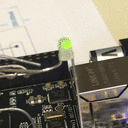

# sensor-test-frame-controller

Currently using Beaglebone Debian image:

    $ cat /etc/dogtag
    BeagleBoard.org Debian Image 2018-01-28

Which contains

    $ python --version
    Python 2.7.13

    $ python3 --version
    Python 3.5.3

## Installing `pip` for python3

This Debian image does not include pip for python3 by default.  To install it:

    sudo apt-get update
    sudo apt-get install -y python3-pip

## Installing the Adafruit BBIO library

On Python 2:

    pip install Adafruit_BBIO

On Python 3:

    sudo apt-get install -y python3-smbus
    pip3 install Adafruit_BBIO

  Test that it worked (replace `python` with `python3` to test Python 3):

     $ python -c "import Adafruit_BBIO.GPIO as GPIO; print(GPIO)"
     <module 'Adafruit_BBIO.GPIO' from '/home/debian/.cache/Python-Eggs/Adafruit_BBIO-1.0.10-py2.7-linux-armv7l.egg-tmp/Adafruit_BBIO/GPIO.so'>

Hooray [this](https://learn.adafruit.com/blinking-an-led-with-beaglebone-black/the-python-console) works!

## Installing this package

    pip install --user -e .

To automatically install the development dependencies

    pip install --user -e .[dev]

If you change the gRPC prototype defined in `frame_controller/frame_controller.proto`, you must install the development dependencies about, then run `make proto` to rebuild the protobuf definitions.

## Rnuning the package

`apps/frame_server` is the entrypoint for the frame server.

In one window, run:

    python apps/frame_server

In another window:

    python apps/frame_client
